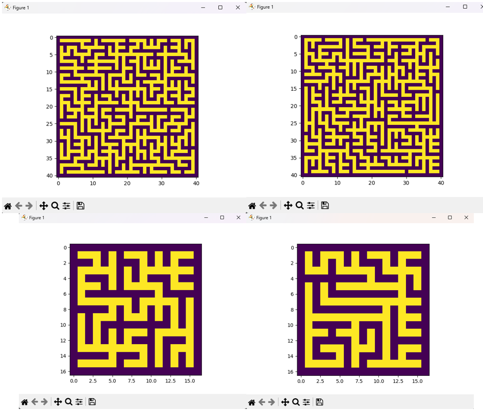

Procedural generation of mazes using graphs and kruskal algorithm.

Input:

  -Maze size x
  
  -Maze size y
  
  -Max random weights number
  
Output:

  -Array representation of the maze (connections and walls)
  
  -Maze plot

